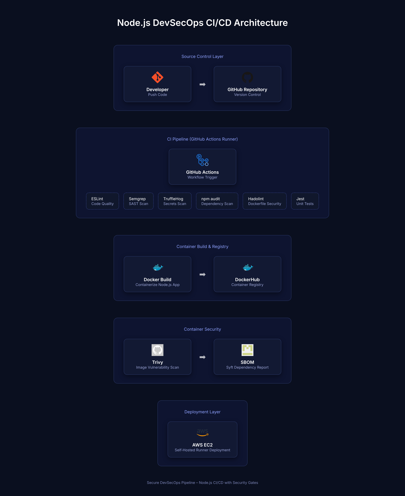
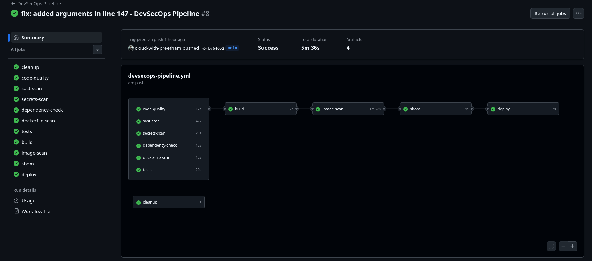
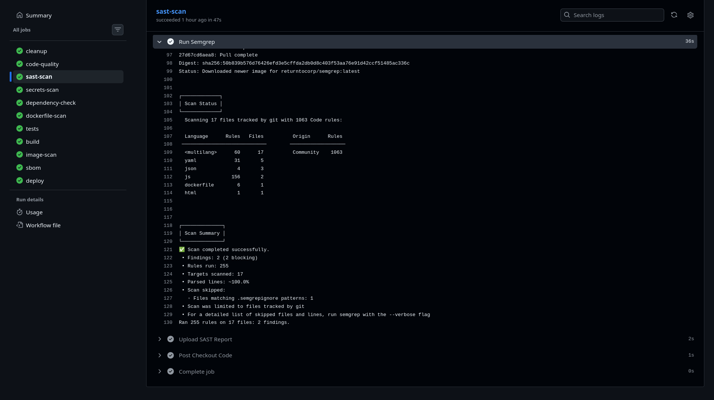
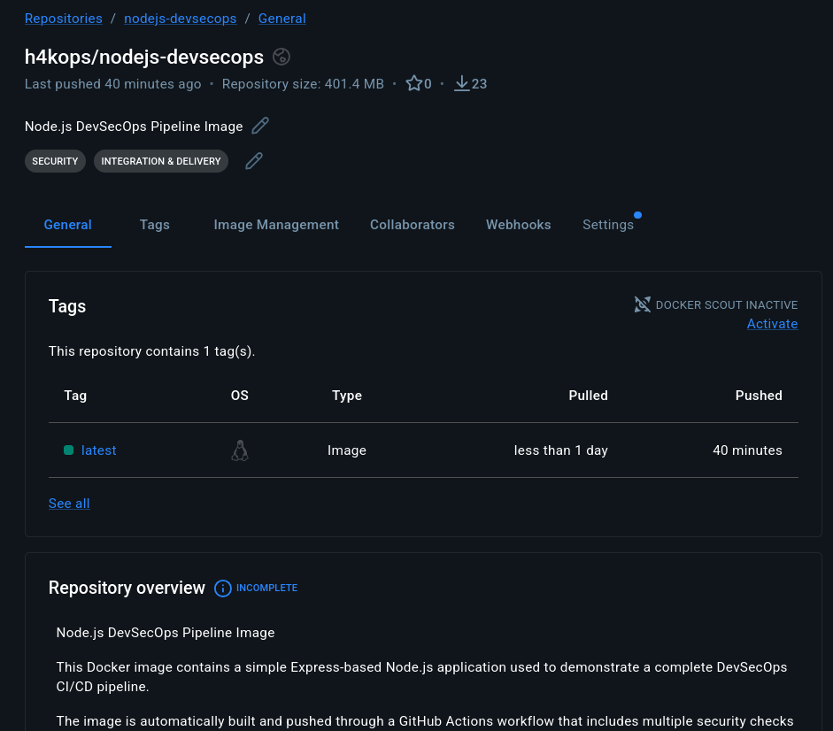
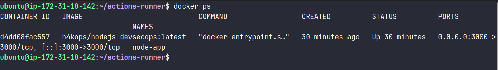
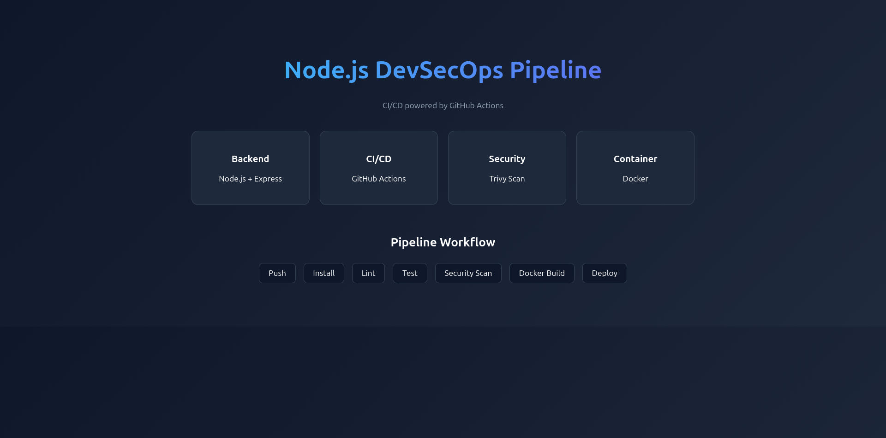
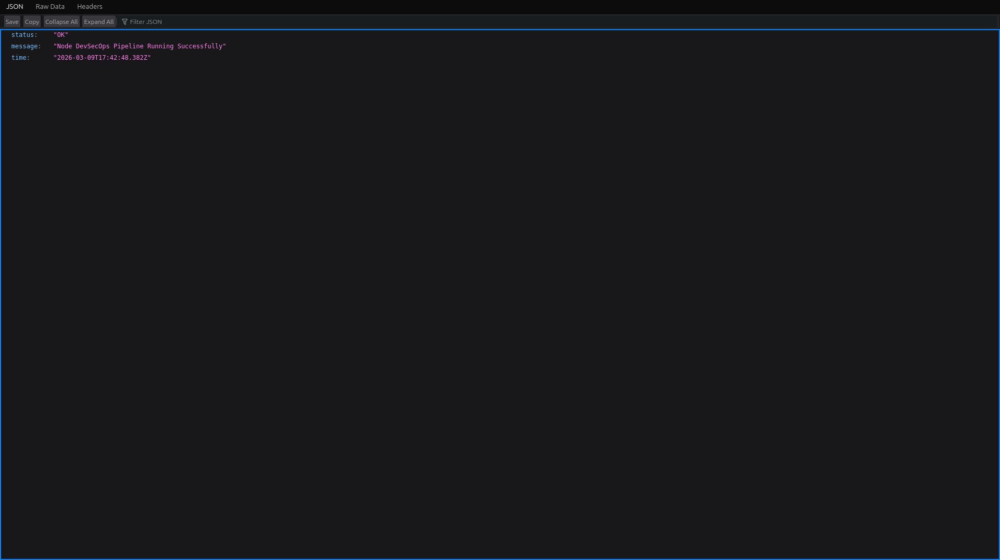

# Node.js DevSecOps Pipeline


A production-style DevSecOps project that automates code quality checks, security scanning, containerization, and deployment for a Node.js application using GitHub Actions.

## Project Goal

Build an end-to-end CI/CD pipeline where security is integrated into every stage, from source code checks to container image scanning and deployment.

## S.T.A.R Explanation (Interview Ready)

### S - Situation

- Typical CI pipelines run tests, but security validation is often added late.
- Manual checks for vulnerabilities and secrets are inconsistent.
- Containerized deployments need repeatable, auditable controls.

### T - Task

- Create a practical DevSecOps pipeline for a Node.js app.
- Add automated gates for code quality, SAST, secrets, dependencies, Dockerfile, and image vulnerabilities.
- Produce security artifacts (reports + SBOM) and deploy automatically after successful checks.

### A - Action

- Built an Express app with an API endpoint and static UI.
- Added Jest + Supertest for API testing and ESLint for code quality.
- Implemented an 11-stage GitHub Actions pipeline in [`devsecops-pipeline.yml`](.github/workflows/devsecops-pipeline.yml).
- Integrated Semgrep, TruffleHog, npm audit, Hadolint, Trivy, and SBOM generation.
- Containerized the app with Docker and pushed images to Docker Hub before deployment.

### R - Result

- Delivered a repeatable DevSecOps workflow with built-in security controls.
- Enabled automated evidence generation through scan artifacts and SBOM output.
- Created a portfolio-ready project that demonstrates CI/CD + security integration in one pipeline.

## Why This Project Matters

Traditional CI pipelines only run tests, but modern DevOps pipelines must integrate security checks directly into the development lifecycle.

This project demonstrates how to implement a DevSecOps workflow where security validation is automated inside CI/CD pipelines.

By integrating static analysis, dependency scanning, container security checks, and artifact generation, the pipeline ensures vulnerabilities are detected early before code reaches production environments.

## Key Features

- Express-based Node.js web app with `/api` health-style endpoint
- Automated linting and test validation
- Multi-layered security scanning inside CI/CD
- Docker image build and Docker Hub push automation
- Trivy image scan and SBOM report generation
- Deployment through a self-hosted GitHub Actions runner

## Architecture

```text
Developer Push (main)
        |
        v
GitHub Actions (DevSecOps Workflow)
        |
        +--> Lint (ESLint)
        +--> SAST (Semgrep)
        +--> Secrets Scan (TruffleHog)
        +--> Dependency Scan (npm audit)
        +--> Dockerfile Scan (Hadolint)
        +--> Tests (Jest + Supertest)
        |
        v
Docker Build + Push (Docker Hub)
        |
        v
Image Scan (Trivy) + SBOM (SPDX)
        |
        v
Deploy Container (self-hosted runner)
```

## Pipeline Stages (Primary Workflow)

Primary workflow file: `.github/workflows/devsecops-pipeline.yml`

1. `cleanup` - Clears Docker cache on self-hosted runner
2. `code-quality` - Runs ESLint
3. `sast-scan` - Runs Semgrep
4. `secrets-scan` - Runs TruffleHog
5. `dependency-check` - Runs `npm audit`
6. `dockerfile-scan` - Runs Hadolint
7. `tests` - Runs Jest test suite
8. `build` - Builds and pushes Docker image
9. `image-scan` - Scans image with Trivy
10. `sbom` - Generates SBOM artifact
11. `deploy` - Pulls latest image and runs container

## Tech Stack

| Category            | Tools                             |
| ------------------- | --------------------------------- |
| Application Runtime | Node.js, Express                  |
| CI/CD               | GitHub Actions                    |
| Testing             | Jest, Supertest                   |
| Linting             | ESLint                            |
| Containers          | Docker, Docker Hub                |
| SAST                | Semgrep                           |
| Secrets Scanning    | TruffleHog                        |
| Dependency Security | npm audit                         |
| Dockerfile Security | Hadolint                          |
| Image Security      | Trivy                             |
| SBOM                | Anchore SBOM Action (SPDX output) |

## Security Tools Used

This project integrates multiple security tools inside the CI/CD pipeline.

- **Semgrep** – Static Application Security Testing (SAST)
- **TruffleHog** – Secrets detection
- **npm audit** – Dependency vulnerability scanning
- **Hadolint** – Dockerfile security linting
- **Trivy** – Container vulnerability scanning
- **SBOM** – Software Bill of Materials generation

## Project Structure

```text
nodejs-devsecops-pipeline/
├── app/
│   └── server.js
├── public/
│   └── index.html
├── tests/
│   └── api.test.js
├── .github/workflows/
│   ├── devsecops-pipeline.yml
│   ├── ci.yml
│   ├── lint.yml
│   ├── security.yml
│   └── docker.yml
├── Dockerfile
├── package.json
└── README.md
```

## API Endpoint

| Endpoint | Method | Description                                    |
| -------- | ------ | ---------------------------------------------- |
| `/api`   | GET    | Returns service status, message, and timestamp |

## Run Locally

1. Install dependencies

```bash
npm install
```

2. Start the app

```bash
npm start
```

3. Open in browser

- `http://localhost:3000`
- `http://localhost:3000/api`

## Run Quality Checks

```bash
npm run lint
npm test
```

## Run with Docker

```bash
docker build -t nodejs-devsecops .
docker run --rm -p 3000:3000 --name node-app nodejs-devsecops
```

## GitHub Actions Setup

To run the full DevSecOps pipeline, configure:

- A self-hosted GitHub Actions runner with Docker installed
- Repository variable: `DOCKER_USERNAME`
- Repository secret: `DOCKER_TOKEN`

Trigger:

- Push to `main` triggers the primary DevSecOps pipeline
- Pull requests trigger `ci.yml` test workflow

## Security Artifacts Generated

- `semgrep-report.json`
- `dependency-report.json`
- `trivy-report.txt`
- `sbom.spdx.json`

## Screenshots

### 1. DevSecOps Architecture Diagram



### 2. Pipeline Overview (GitHub Actions)



### 3. Security Scan Evidence (Semgrep)



### 4. Docker Hub Push Evidence



### 5. Deployment Evidence (EC2)



### 6. Live Application Proof (`/`)



### 7. API Live Proof (`/api`)



## Future Improvements

- Add infrastructure provisioning with Terraform
- Add environment-specific deployments (dev/stage/prod)
- Add policy-as-code gates for stronger compliance checks
- Add monitoring and alerting integrations (Prometheus/Grafana/Slack)

## Author

- Name: Preetham Pereira
- Role: DevOps and Cloud Enthusiast
- GitHub: [cloud-with-preetham](https://github.com/cloud-with-preetham)
